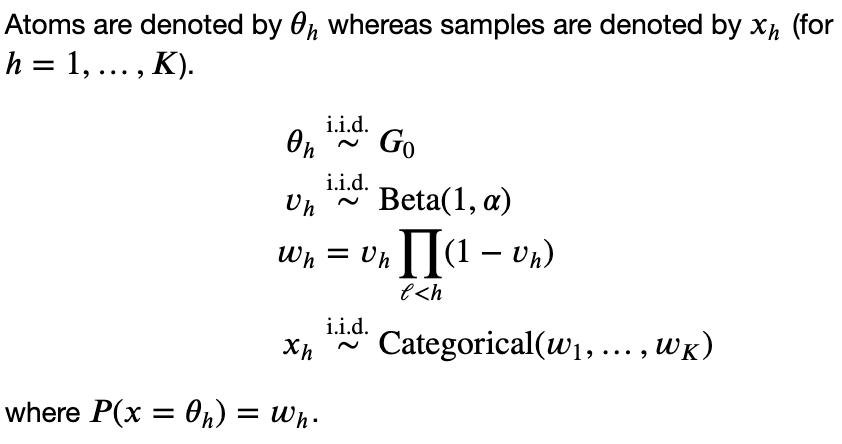

## July 29, 2021

#### What I worked on

- Retrieving concentration parameter from weights (notebook [here](https://github.com/larryshamalama/pymc3-playground/blob/master/notebooks/progress/dp-recover-basic-parameters.ipynb))
	- I suspect that my simulations don't work well with small M values due to precision error. It might not be the case. [Here](https://github.com/larryshamalama/pymc3-playground/blob/master/notebooks/shortcomings/replicate-precision-error.ipynb)
- Looking into sampling atoms 
	- Next step: including atoms in the likelihood

#### Specific questions

- Precision issue or much easier solution that I'm not thinking about?
- Sampling from DP...
	- How to provide observed atoms and weights into the model?

#### Administrative

- Theory exams next week... 
